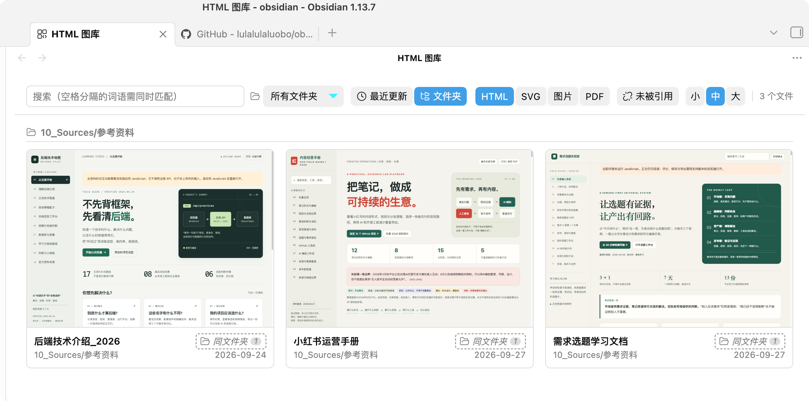
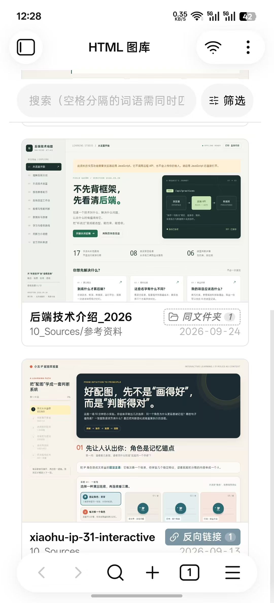

# HTML 图库

本项目基于 [violetyk/obsidian-html-gallery](https://github.com/violetyk/obsidian-html-gallery) 开发，并在原项目基础上进行二次开发。当前版本新增了**简体中文设置与界面**、**移动端 HTML 分享到浏览器或其他应用**，以及**更紧凑的移动端图库筛选栏**。原项目的版权与许可信息见 [LICENSE](LICENSE)。

HTML 图库是一个 Obsidian 插件，用于在库内浏览 HTML 文件，并可按需把 SVG、图片和 PDF 一起显示为卡片。

## 功能

- 以卡片形式浏览库内的 HTML 文件，可搜索文件名、标题和正文。
- 可选显示 SVG、常见图片格式和 PDF，并调整缩略图大小、排序方式与文件夹范围。
- 查看引用某个文件的笔记；没有笔记引用时，可查看同文件夹的笔记候选。
- 在设置中选择自动、English、日本語或简体中文。
- 桌面端在 Obsidian 提供系统文件打开能力时，可将 HTML 交给默认应用打开。
- 移动端可通过系统分享菜单将 HTML 文件交给浏览器或其他应用。手机上的图库默认收起筛选项，点击「筛选」即可展开。

移动端分享只会传递当前 HTML 文件。若页面依赖库内单独存放的 CSS、JavaScript 或图片，这些文件不会随 HTML 一起分享。

## 界面截图

桌面端图库：



移动端图库：



## 通过 BRAT 安装

1. 在 Obsidian 的「设置 → 第三方插件」中安装并启用 [BRAT](https://github.com/TfTHacker/obsidian42-brat)。
2. 打开命令面板，运行 **BRAT: Add a beta plugin for testing**。
3. 输入仓库地址 `https://github.com/lulalulaluobo/ob-html-gallery`，然后点击 **Add Plugin**。
4. 安装后，在「设置 → 第三方插件」中启用 **HTML Gallery**。

已安装插件列表按插件名称显示。若看不到它，请搜索 **HTML Gallery**，或滚动到 H 开头的位置。BRAT 的仓库列表只显示跟踪的仓库；可点仓库旁的刷新按钮重新下载插件。

这个二创版本和原项目使用相同的插件 ID `html-gallery`，同一个库中只能保留一个版本。BRAT 从本仓库的 [GitHub Releases](https://github.com/lulalulaluobo/ob-html-gallery/releases) 安装和更新本版本。

## 使用

- 通过命令面板运行 **HTML Gallery: Open gallery** 打开图库。
- 在移动端，搜索框下方的「筛选」按钮可展开文件夹、排序、类型、未引用和缩略图大小选项。
- 如需显示 HTML 文件，请先在 Obsidian「设置 → 文件与链接」中启用「识别所有文件扩展名」。可浏览的文件必须位于当前库内。
- 在文件浏览器中右键或长按文件夹，可将图库范围限定到该文件夹。

## 手动安装

从本仓库的 [最新 Release](https://github.com/lulalulaluobo/ob-html-gallery/releases/latest) 下载 `main.js`、`manifest.json` 和 `styles.css`，放入库目录下的 `.obsidian/plugins/html-gallery/` 文件夹，然后在「设置 → 第三方插件」中启用 **HTML Gallery**。

## 本地构建

需要 Node.js。克隆仓库后运行：

```sh
npm install
npm run build
```

构建生成 `main.js`。将其与仓库中的 `manifest.json`、`styles.css` 一起放进 Obsidian 插件目录即可测试。
